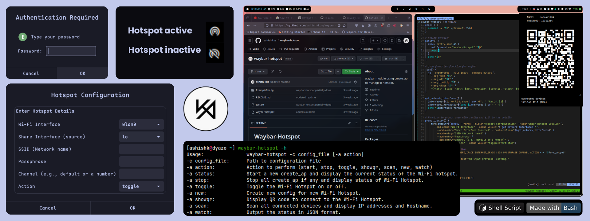

 <div align="center" width="100%">  </div>

# Waybar-Hotspot
Tiny Waybar module to monitor and manage Wi-Fi hotspot status. This module displays the current state of the hotspot and provides notifications and graphical prompts via zenity.

### Features
- Start, stop, and toggle a Wi-Fi hotspot
- Graphical prompts for configuration
- Display connected devices
- Generate QR codes for network details
- Display QRCODE in tooltip
- Supports custom config for create_ap
### Dependencies
- create_ap
- linbnotify
- jq
- Zenity

### Installation
1. Manually by using ``` sudo make install ```.
2. Using AUR package ```waybar-hotspot``` (soon will be avallable on AUR)

### Usage
Waybar Configuration
Add the custom module to your Waybar configuration file:

~/.config/waybar/config.json

```json
"modules-left": [
  ...
  "custom/hotspot",
  ...
],

...

  "custom/hotspot": {
    "format": "{icon}",
    "interval":5,
    "tooltip": true,
    "return-type": "json",
    "format-icons": {
      "active": "󱜠",
      "notactive": "󱜡"
    },
    "exec":"waybar-hotspot -a watch",
    "on-click":"waybar-hotspot -a toggle",
  },

```

### waybar Style
Add custom styles to your Waybar CSS file for better visual representation:
```css
@keyframes blink-active {
  to {
    background-color: lightgreen;
  }
}

#custom-hotspot.active {
  animation: blink-active 3s linear infinite alternate;
}
```

### Command-line Options
The script supports the following options:

- -c :Supports custom config for create_ap.
- ``` -a status ```: Start a new create_ap and display the current status of the Wi-Fi hotspot.
- ``` -a stop ```: Stop all create_ap if any and display status of Wi-Fi Hotspot.
- ``` -a toggle ```: Toggle the Wi-Fi Hotspot on or off.
- ``` -a new ```: Create new config for new Wi-Fi Hotspot.
- ``` -a showqr ```: Display QR code to connect to the Wi-Fi Hotspot.
- ``` -a scan ```: Scan all connected devices and display IP addresses and Hostname.
- ``` watch ```: Output the status in JSON format.


### License
This project is licensed under the MIT License. See the LICENSE file for details.
